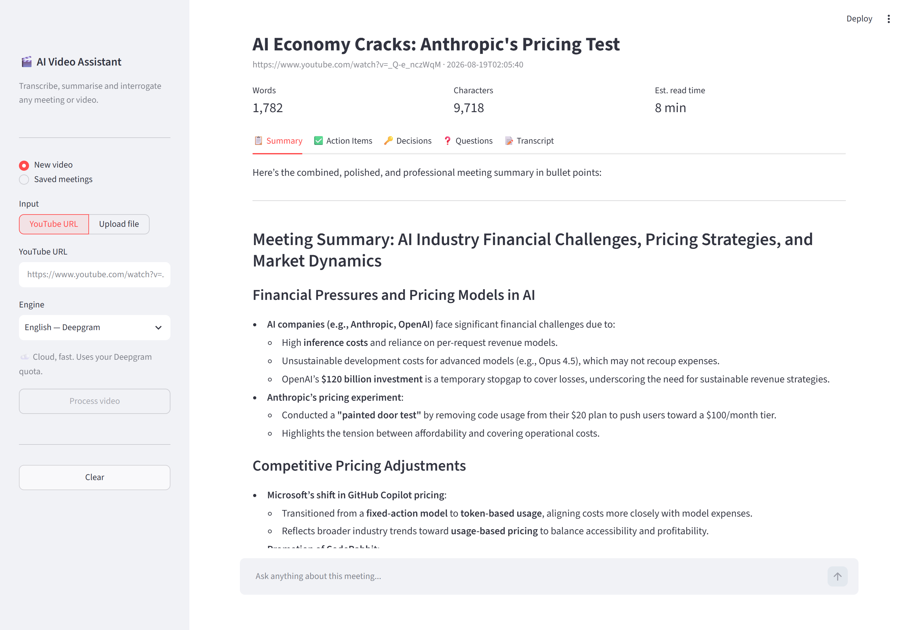
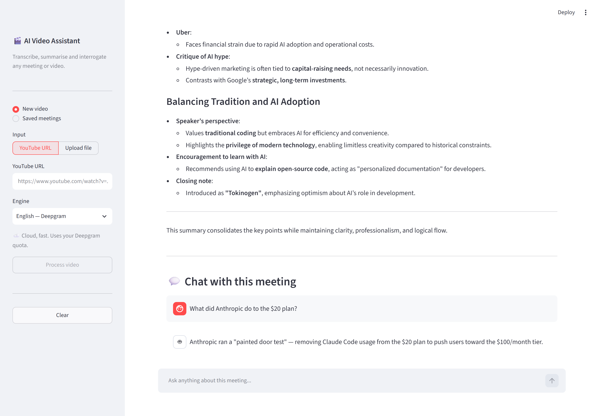

# 🎬 AI Video Assistant

Turn any YouTube video or audio file into a **transcript, a structured summary, extracted action items — and a chatbot you can question about its contents.**

Point it at a two-hour meeting recording and get back the decisions, the follow-ups, and the ability to ask *"what did we agree about the budget?"* without scrubbing the timeline.

---

## Demo

Results view — title, metrics, and the summary / action items / decisions / questions / transcript tabs:



Ask questions about the transcript, answered from what was actually said:



---

## What it does

```
YouTube URL / audio file
          │
          ▼
   ┌─────────────┐   yt-dlp + ffmpeg + pydub
   │   1. AUDIO  │   download → WAV → 10-minute chunks
   └─────────────┘
          │
          ▼
   ┌─────────────┐   Deepgram (English) · Sarvam (Hinglish) · Whisper (local)
   │ 2. TRANSCRIBE│
   └─────────────┘
          │
          ▼
   ┌─────────────┐   Mistral via LangChain — map-reduce over long transcripts
   │ 3. SUMMARISE │   title · summary · action items · decisions · questions
   └─────────────┘
          │
          ▼
   ┌─────────────┐   Chroma + HuggingFace embeddings, retrieval-augmented Q&A
   │  4. CHAT     │
   └─────────────┘
```

Every processed video is **saved to disk**, so reopening one is instant — no re-download, no re-transcription, no API spend.

---

## Features

- **Two front ends** — a Streamlit web UI and a terminal CLI, sharing one pipeline
- **Three transcription engines**, switchable per run
- **Handles long recordings** — audio is chunked, and summaries are map-reduced so transcripts never blow the context window
- **Chat with your transcript** — RAG over Chroma, answers grounded in what was actually said
- **Persistent library** — every run is saved and reloadable in seconds
- **Upload or stream** — YouTube URLs or local mp3/wav/m4a/mp4/mkv files
- **Pre-flight checker** — validates every key, binary and service before you commit to a long run

---

## Transcription engines

| Engine | Language | Runs on | Speed | Cost |
|---|---|---|---|---|
| **Deepgram** *(default)* | English | Cloud | ~12s per 90s of audio | API credits |
| **Sarvam** | Hinglish → English | Cloud | Slower — 25s slices | API credits |
| **Whisper** | English | Your CPU | Minutes; laptop gets warm | Free, offline |

Deepgram is roughly **an order of magnitude faster** than local Whisper. Whisper remains available for offline or zero-cost use.

> **Tip:** cloud engines can mishear domain jargon and product names. Deepgram supports keyword boosting via a `keyterm` parameter if you process specialist content.

---

## Requirements

- **Python 3.10+** (developed on 3.12)
- **ffmpeg** on your `PATH` — required by `pydub` and `yt-dlp`
  - Windows: `winget install Gyan.FFmpeg`
  - macOS: `brew install ffmpeg`
  - Linux: `sudo apt install ffmpeg`
- API keys for [Deepgram](https://console.deepgram.com/), [Mistral](https://console.mistral.ai/), and optionally [Sarvam](https://dashboard.sarvam.ai/)

---

## Setup

```bash
git clone <your-repo-url>
cd "AI Video Assistant"

python -m venv .venv
# Windows
.venv\Scripts\activate
# macOS / Linux
source .venv/bin/activate

pip install -r requirements.txt
```

Then create your `.env` from the template and fill in your keys:

```bash
cp .env.example .env
```

```env
DEEPGRAM_API_KEY=your_key_here
MISTRAL_API_KEY=your_key_here
SARVAM_API_KEY=your_key_here      # only for Hinglish
```

Verify everything before your first real run:

```bash
python check_setup.py
```

```
Environment
  ✅  DEEPGRAM_API_KEY             set (English transcription)
  ✅  MISTRAL_API_KEY              set (summary / extraction / chat)
Binaries
  ✅  ffmpeg                       ffmpeg version 8.0.1
  ✅  yt-dlp                       v2026.07.04
Services (live calls)
  ✅  Deepgram                     HTTP 200 (model=nova-3)
  ✅  Mistral                      HTTP 200
==========================================================
✅ All checks passed — run:  streamlit run app.py
```

---

## Usage

### Web UI

```bash
streamlit run app.py
```

Opens at `http://localhost:8501`. Paste a URL or drop a file in the sidebar, pick an engine, and watch the pipeline report progress live. Results land in five tabs, with a chat box underneath.

### Terminal

```bash
python main.py
```

```
Saved meetings:
  [1] ai_economy_cracks_anthropic_s_pricing_te_20260819_020531

Pick a number to reopen, or paste a YouTube URL / file path: 1
Loaded: AI Economy Cracks: Anthropic's Pricing Test
...
💬 Chat with your meeting (type 'exit' to quit)
You: what did they decide about pricing?
```

That first prompt takes **either** a number (reopen a saved meeting) **or** a URL / file path (process something new).

---

## Project structure

```
├── app.py                  # Streamlit web UI
├── main.py                 # CLI + pipeline orchestration + persistence
├── check_setup.py          # pre-flight validator
├── core/
│   ├── transcriber.py      # Deepgram / Sarvam / Whisper routing
│   ├── summarizer.py       # title + map-reduce summary (Mistral)
│   ├── extractor.py        # action items, decisions, open questions
│   ├── vector_store.py     # Chroma, one collection per meeting
│   └── rag_engine.py       # retrieval-augmented Q&A chain
├── utils/
│   └── audio_processor.py  # yt-dlp download, WAV conversion, chunking
├── outputs/                # saved meetings (gitignored)
├── downloads/              # cached audio (gitignored)
└── vector_db/              # Chroma embeddings (gitignored)
```

---

## Troubleshooting

**`HTTP Error 403: Forbidden` when downloading**
YouTube gates most player clients behind a proof-of-origin token. `audio_processor.py` pins the clients that still serve media (`android`, `tv_simply`). If it resurfaces, update `yt-dlp` first — YouTube changes this often.

**`UnicodeEncodeError: 'charmap' codec can't encode character`**
Windows defaults stdout to cp1252, which cannot represent emoji — including emoji the LLM writes into its own answers. Both entry points call `sys.stdout.reconfigure(encoding="utf-8")` at the top. Keep it there.

**`SARVAM_API_KEY is not set` even though it is**
`transcriber.py` reads its keys at *module import time*, so `load_dotenv()` must run **before** any `core/` import. Both `main.py` and `app.py` are ordered deliberately — reordering those imports will silently break Sarvam with a misleading error.

**Whisper pegs the CPU**
Expected — Whisper runs locally in FP32 with no GPU. Use the default Deepgram engine instead, or set a smaller `WHISPER_MODEL`.

---

## Notes on cost and privacy

Deepgram, Sarvam, and Mistral are **cloud services** — audio and transcripts leave your machine. For sensitive recordings, use the `whisper` engine, which transcribes entirely offline (summarisation and chat still call Mistral).

`downloads/` grows by roughly 100 MB per hour of processed audio and is never cleaned automatically.

---

## License

MIT — see `LICENSE`.
